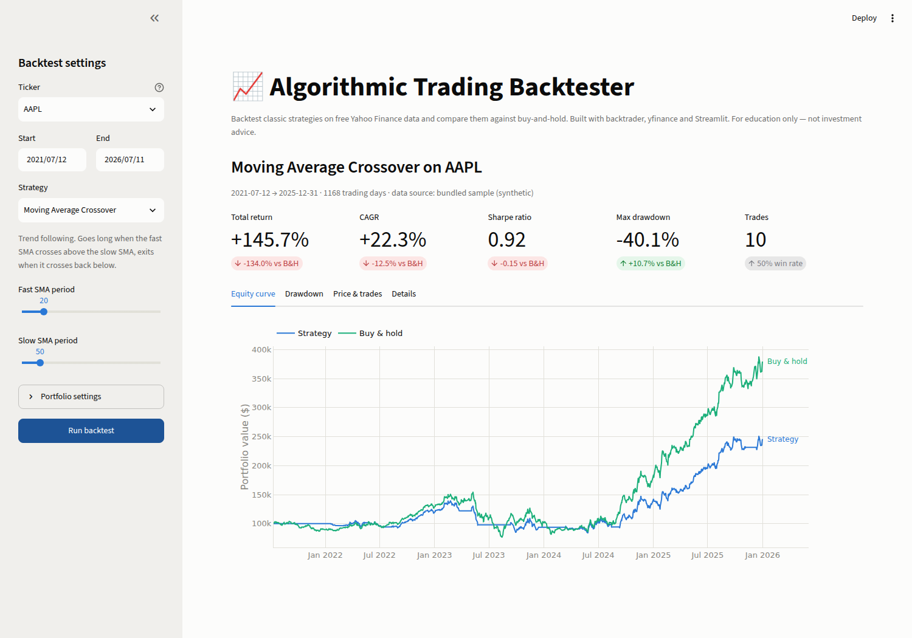
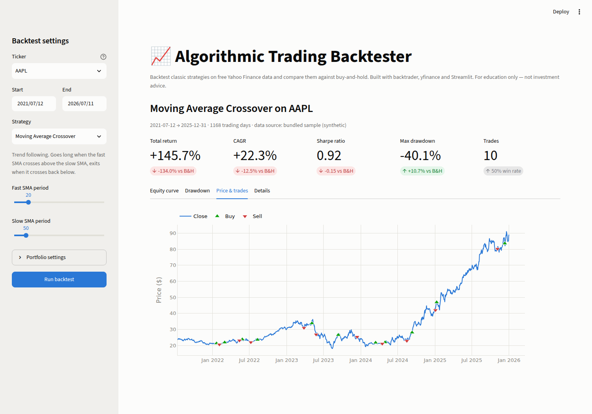

# 📈 Algorithmic Trading Backtester

**🔴 Live demo: [algo-trading-backtester-5nwlzkaxubapphojrv7mptk.streamlit.app](https://algo-trading-backtester-5nwlzkaxubapphojrv7mptk.streamlit.app)**

Multi-strategy backtesting engine for equities — Sharpe ratio, drawdown & CAGR
analysis with a live Streamlit dashboard. Backtest classic strategies on free
Yahoo Finance data and compare them against buy-and-hold.



**Stack:** [yfinance](https://github.com/ranaroussi/yfinance) (data) ·
[backtrader](https://www.backtrader.com/) (engine) ·
[Streamlit](https://streamlit.io/) + [Plotly](https://plotly.com/python/) (dashboard).
Everything is free and open-source.

## Strategies

| Strategy | Idea | Parameters |
|---|---|---|
| **Moving Average Crossover** | Trend following — long when the fast SMA crosses above the slow SMA, exit on the cross back below | fast/slow SMA periods |
| **RSI Mean Reversion** | Contrarian — buy oversold dips (RSI below the lower band), exit once RSI recovers | RSI period, oversold & exit thresholds |
| **Momentum** | Time-series momentum — stay long while the trailing return over the lookback window is positive | lookback window |

## Metrics

Every backtest reports **Sharpe ratio**, **max drawdown**, **CAGR**, total
return, annualized volatility, trade count and win rate — side by side with a
**buy-and-hold benchmark** on the same data, dates and starting capital.

## Dashboard

Pick a ticker, strategy and parameters in the sidebar and every chart, metric
and trade updates live. Buy/sell markers show exactly where the strategy
entered and exited:



## Run locally

```bash
git clone https://github.com/sahilsharma0309/algo-trading-backtester.git
cd algo-trading-backtester
pip install -r requirements.txt
streamlit run app.py
```

Open http://localhost:8501, pick a ticker + strategy in the sidebar, tune the
parameters, and hit **Run backtest**.

### Run the tests

```bash
pip install pytest
pytest
```

Tests run entirely on the bundled sample data — no network needed.

## Deploy free on Streamlit Community Cloud

1. Push this repo to GitHub (public).
2. Go to [share.streamlit.io](https://share.streamlit.io) and sign in with GitHub.
3. Click **Create app → Deploy a public app from GitHub**, pick this repo,
   branch `main`, main file `app.py`.
4. Click **Deploy** — you get a permanent free `https://<app-name>.streamlit.app` URL.

No config needed: `requirements.txt` is detected automatically and
`.streamlit/config.toml` applies the theme.

## Project structure

```
├── app.py                      # Streamlit dashboard
├── backtester/
│   ├── data.py                 # yfinance loader + offline sample fallback
│   ├── strategies.py           # 3 backtrader strategies + registry for the UI
│   ├── engine.py               # backtest runner + buy-and-hold benchmark
│   └── metrics.py              # Sharpe, max drawdown, CAGR, volatility
├── data/samples/               # synthetic OHLCV CSVs (offline demo mode)
├── scripts/generate_sample_data.py
└── tests/test_backtester.py
```

### Offline demo mode

If Yahoo Finance is unreachable (rate limits, firewalls), the app falls back to
bundled **synthetic** sample data (regime-switching GBM, seeded/reproducible)
and shows a clear warning banner. Regenerate the samples with
`python scripts/generate_sample_data.py`.

## Disclaimer

Educational project. Backtested performance uses simplified assumptions (no
slippage, market orders at the next open, fixed commission in bps) and is not
indicative of future results. **Not investment advice.**
